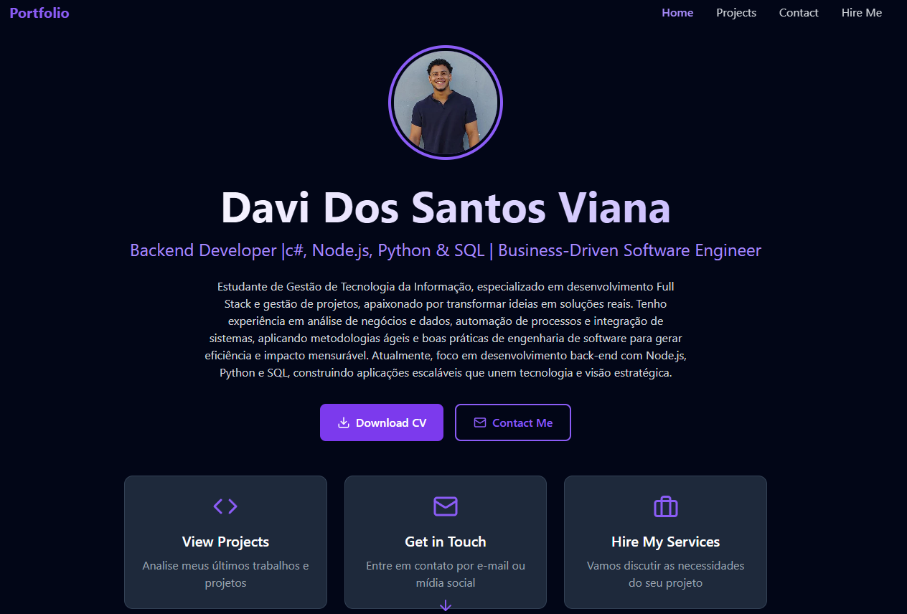

# Portfolio

Meu site pessoal – [about-me.davi.vercel.app](https://about-me-davi.vercel.app)

## Sobre

Este repositório contém o código-fonte do meu portfólio pessoal. É o espaço onde apresento quem sou, minhas habilidades, projetos e aspirações como profissional em transição para TI e Engenharia de Software.

## Tecnologias

O projeto foi desenvolvido com as seguintes principais tecnologias:

- TypeScript
- React
- Vite
- Tailwind CSS
- HTML & CSS
- Node.JS

## Estrutura do Projeto

/
├─ src/ # Código-fonte principal
├─ index.html # Arquivo de entrada
├─ vite.config.ts # Configuração do Vite
├─ tailwind.config.js # Configuração do Tailwind
├─ tsconfig.json # Configuração do TypeScript
├─ package.json # Dependências e scripts
└─ README.md # Este arquivo

## Funcionalidades

- Layout responsivo para desktop, tablet e mobile
- Apresentação de perfil pessoal, competências técnicas e projetos
- Uso de icons para tecnologias (TypeScript, JavaScript, etc)
- Deploy contínuo (por exemplo via Vercel)

## Como rodar localmente

1. Clone o repositório

```bash
git clone https://github.com/Davi-CleanCode/Portfolio.git
cd Portfolio
npm install
npm run dev
Abra no seu navegador: http://localhost:5173 (ou porta indicada)

## Como rodar localmente

Oi! Eu sou o Davi. Atualmente trabalho como auxiliar fiscal na Aunde Brasil, mas estou em transição para a área de TI / Engenharia de Software.
Tenho boas habilidades analíticas, sou diplomático, tenho tato para gestão e liderança, e já atuo em ambiente de compliance e finanças.
Atualmente curso Gestão de Tecnologia da Informação e me dedico a aprender full-stack e DevOps.
Este portfólio é parte da minha estratégia para mostrar presença online, profissionalismo e meu crescimento nessa nova direção.


```
